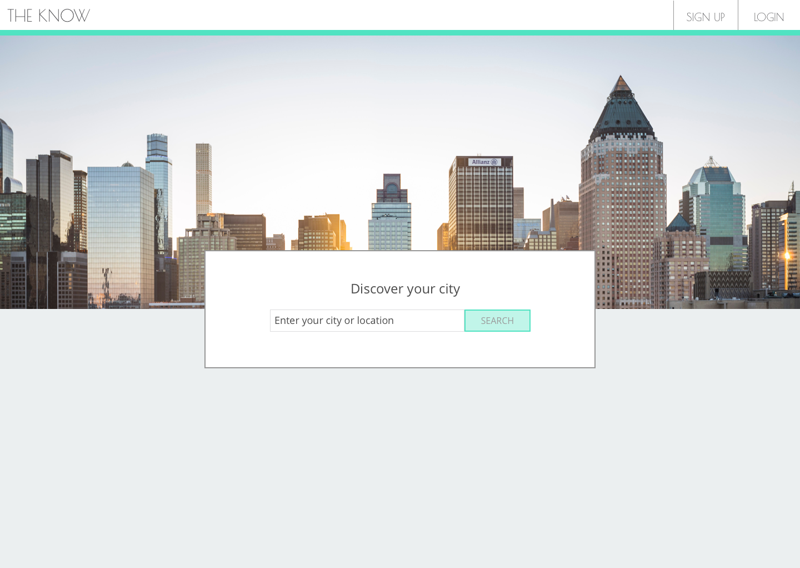
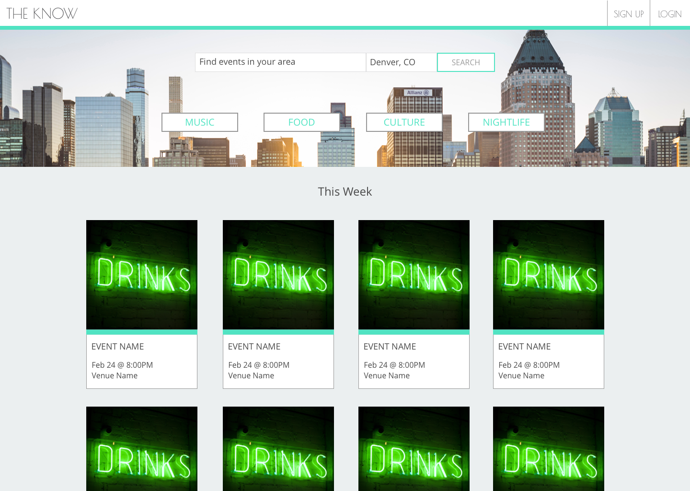
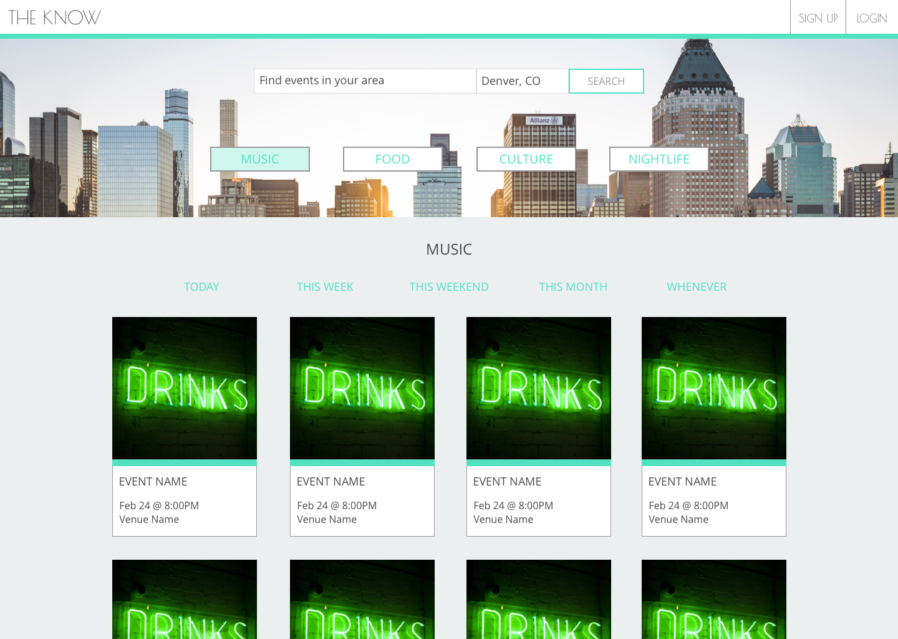

# The Know

## Synopsis

The Know is an application where a user can search through upcoming events using their current location or entering a city of their choice. The user can filter events by category and when they are taking place. For this project, I was given two weeks to build out a web application that successfully implemented React.js and a Redux store, fetched data from various API's, and also fully tested the application using Jest and Enzyme. 

## Motivation

As a lifelong nomad, I have had the opportunity to move to multiple cities. But every time I move to a new city, I never know what's going on in my new town. I always look for websites that look like I can trust the suggested events they give me, but many of the places with the most information have an outtdated UI/UX. So for this project, I wanted to create an event application with a modern face lift that would make even the most distrustful hipster believe in it. 

## Installation

Clone down the repo: `git clone git@github.com:soytjan/the-know.git`

`npm install`

`npm start`

## API Reference

This application pulls in the Google Maps Geolocation and Geocoding APIs, and also the Eventful API. 

To get this application running locally, you will need to get keys from both of these API's.

[Google Maps API Documentation](https://developers.google.com/maps/documentation/)
[Eventful API](http://api.eventful.com/)

You will then need to save those keys in a file `src/api/keys.js` in the following format: 

```
const keys = {
  eventfulKey: 'Eventful key here',
  googleMapsApiKey: 'Google Maps API key here'
}

export default keys;
```

## Tests

To run the testing suites, `cd the-know` and run `npm test`

## Contributors

Amanda Tjan is the software developer for this project.

## Wireframes
Welcome Page

Main Landing Page

Music Category Landing Page



